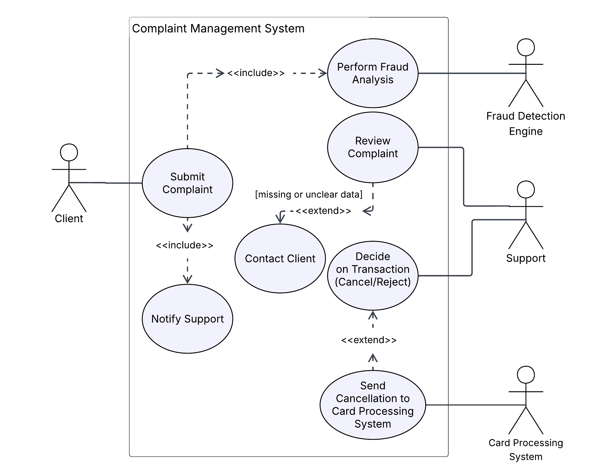
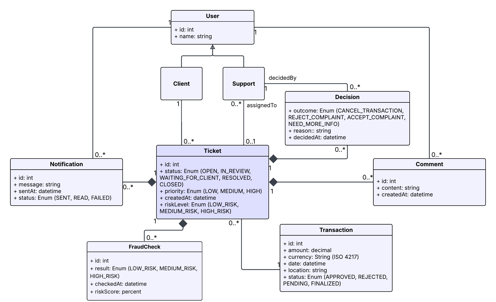
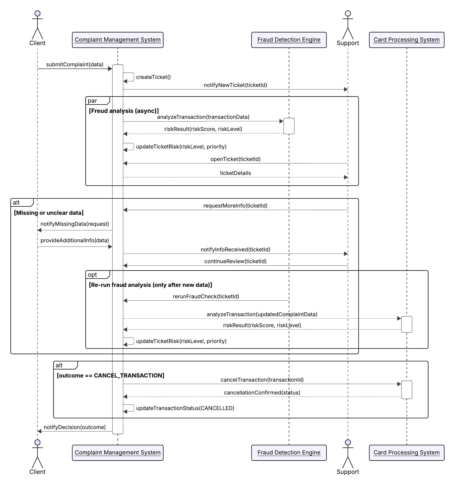
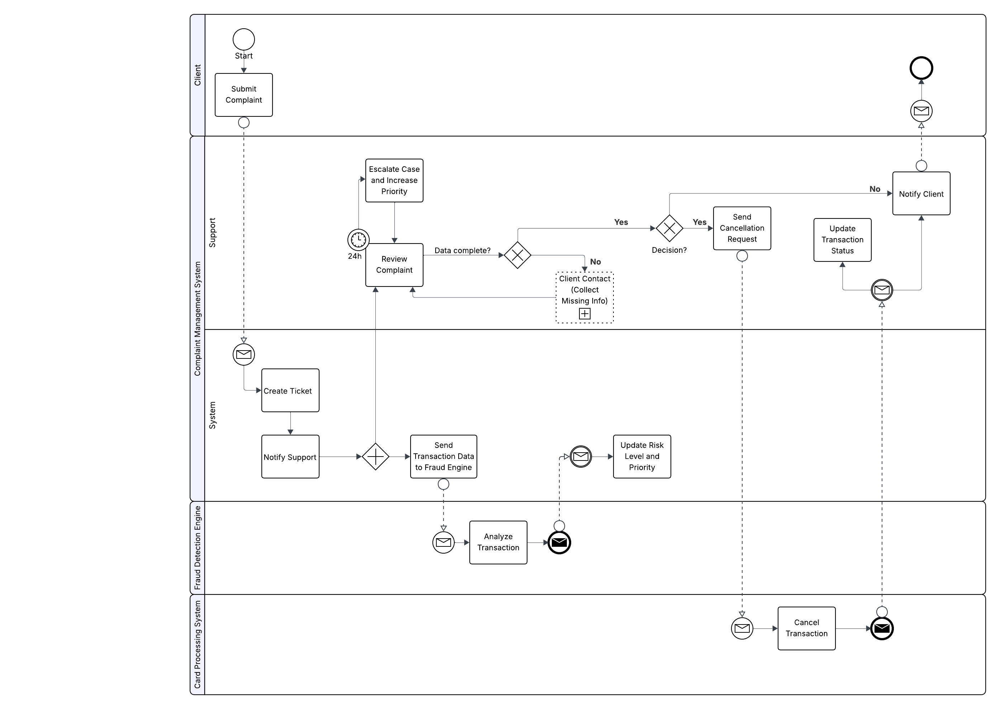
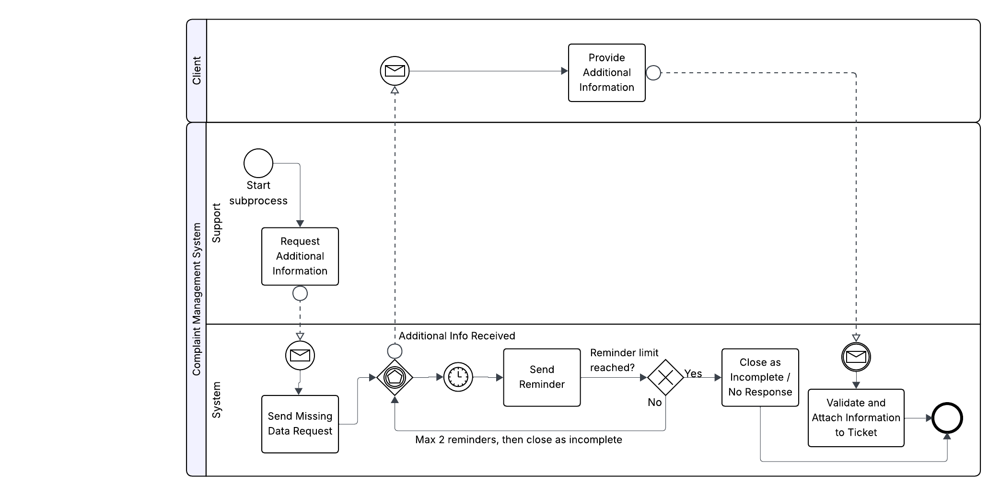

# Card Transaction Complaint Management System - Process Analysis & UML Modeling Case Study

## Business Context
The system manages complaints submitted by bank clients regarding card transactions. Its purpose is to provide fast and accurate processing of complaints, support the customer service team in analyzing potentially unauthorized or erroneous transactions, and minimize fraud risk.

## Process Overview:
The process begins with the client submitting a complaint. The system creates a ticket and triggers fraud analysis asynchronously, while Support simultaneously reviews the case. If additional information is required, the Client Contact subprocess is initiated. Based on the final decision, the system may integrate with the Card Processing System to cancel the transaction and notify the client of the outcome.

## Scope of Analysis:
* Business process modeling in BPMN
* UML diagrams: Use Case, Class, Sequence
* Functional and non-functional requirements analysis
* Integration with Fraud Detection Engine and Card Processing System

## Primary Roles in the System:
* **Client** – submits complaints
* **Support** – verifies complaints and makes decisions
* **Complaint Management System** – core process automation
* **Fraud Detection Engine** – independent system for risk analysis
* **Card Processing System** – external system used to cancel/reject transactions after a decision

## Selected Functional Requirements:
1. Collect complaint data from clients, including transaction ID, date, amount, and reason.
2. Perform automated fraud analysis and flag high-risk transactions.
3. Notify support team and set complaint priority based on risk and workflow rules.
4. Enable cancellation of transactions via integration with the Card Processing System based on Support decisions.
5. Allow Support to manually re-run fraud analysis after receiving additional client information.

## Selected Non-Functional Requirements:
* Enforced via interrupting boundary timer event in the BPMN model.
* Maintain complete audit logs of all actions and decisions.
* Provide system resilience via asynchronous processing to handle high complaint volumes.

## Modeling Assumptions
* Fraud analysis is asynchronous and does not block support review.
* A complaint may undergo multiple fraud checks.
* Complaints with no client response after reminders are closed as Incomplete.
* Decision to cancel requires external system confirmation.

## Key Diagrams to Include:
1. **Use Case Diagram** – shows actors and primary system use cases 
    
2. **Class Diagram** – illustrates system objects, relationships, and inheritance 
    
3. **Sequence Diagram** – demonstrates the flow of actions from complaint submission to resolution 
    
4. **BPMN Diagram** – full end-to-end process including the “Client Contact” subprocess and asynchronous fraud analysis 
    
5. **Client Contact Subprocess** - captures the client follow-up flow when complaint details are missing, including reminders and closing the case as Incomplete if no response is received.
    

